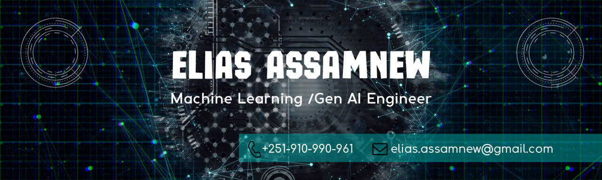

# Hi there 👋, I'm Elias Assamnew

<table width="100%">
  <tr>
    <td width="55%">
      <h2> 💻 &nbsp;About Me </h2>
       
      <blockquote>
        
 
          Passionate Generative AI Engineer from Ethiopia, dedicated to pushing the boundaries of artificial intelligence.
            
          Currently focused on Generative AI and Machine Learning, with a keen interest in computer vision and deep learning.
            
          Always eager to collaborate on AI-related projects and explore new frontiers in technology.
        

      </blockquote>
       <ul>
        <li>👨‍💻 &nbsp; Working on Generative AI and ML</li>
        <li>🤝🏼 &nbsp; Open to collaborations in AI</li>
        <li>🌱 &nbsp; Learning computer vision and deep learning</li>
        <li>📫 &nbsp; Reach me at: elias.assamnew@gmail.com</li>
       </ul>
        
    </td>
  <td width="45%">
      

          
      

  </td>
  </tr>
  <tr>
    <td width="55%">
      

         
        
      

    </td>
    <td width="45%">
      

         
        
      

    </td>
  </tr>
  <tr>
   <td width="55%">
     <h2> 🛠 &nbsp;Tech Stack</h2>
     

       
       
       
       
       
       
       
       
       
       
       
       
       
       
       
       
     

   </td>
   <td width="45%">
    

      <h2><b>Connect with Me</b></h2>
       
      
Let's connect and discuss exciting AI projects!

       
       &nbsp;&nbsp;
       &nbsp;&nbsp;
      
    

   </td>
  </tr>
</table>

## 🚀 Current Focus

- Exploring advanced techniques in Generative AI
- Developing innovative ML models for real-world applications
- Enhancing skills in computer vision and deep learning
- Contributing to open-source AI projects

## 📈 GitHub Stats

  

## 🎯 Future Goals

- Contribute to groundbreaking AI research
- Develop AI solutions that positively impact society
- Collaborate with global AI communities
- Continuously learn and adapt to emerging AI technologies

---

  <i>Let's connect and create amazing AI-powered solutions together!</i>

